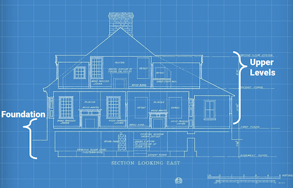

# Phase 1 Project Template - Minimum Viable Product (MVP)

This repository is like a blueprint, providing structure for your first End of Phase Project. We suggest you base your Phase 1 project off of this repository so you can focus less on formatting and organization, and more on the _analysis and communication skills_ that will support your progress through the course. This template is designed to make your project portfolio-ready in order to impress the future employers who will review it. 

## Repository Contents

Below is a list of the contents of this repository - instructions for using them are in the next section.

- `README.md`: The README for this repo explaining its contents - you're reading it now.
- `TEMPLATE_README.md`: An example of a project README that provides a brief overview of your whole project.
- `dsc-phase1-project-template.ipynb`: A starter Jupyter Notebook with headings, code examples and guiding questions.
- `create_sql_database.ipynb`: A notebook for creating a SQL database if you would prefer to use SQL for this project.
- `DS_Project_Presentation_Template.pdf`: A starter slide deck presenting your project - here is an [editable version](https://docs.google.com/presentation/d/1PaiH1bleXnhiPjTPsAXQSiAK0nkaRlseQIr_Yb-0mz0/copy).
- `data` folder: A folder for the data you reference with your code.
- `src` folder: A folder containing custom functions.
- `images` folder: A folder for the images you reference in your files .
- `.gitignore`: A hidden file that tells git to not track certain files and folders.

## Instructions For Using This Repository

### Create a new Github repository. 
If you are working in a group, only one member of your team should complete these steps.

1. Click [this link](https://github.com/new) and set up a new Github  Repository.
   - Give your repository a name that is descriptive of the project. (You can change this later if you think of a better name)
   - Set the repository to public
   - Skip the `Initialize this repository with` section.
   - Click `Create Repository`
   - Set your group members as collaboators.

2. Clone the repository you created in step 1
   - Click the green code button
   - Copy the provided https link. (It should end with `.git`)
   - Open a terminal window
   - cd into your phase 1 folder
   - Clone the github repository
   
3. Pull down the project files
   - cd into the newly created project folder from step 2
   - run `git remote add upstream https://github.com/learn-co-students/bsc-phase-1.git`
   - run `git pull upstream main`   

4. Push the project files to your personal github repository

If you are working in a group, and did not complete the above steps, you should clone the repository made by your team member.

### Use The Slide Template

1. Go to [this link](https://docs.google.com/presentation/d/1PaiH1bleXnhiPjTPsAXQSiAK0nkaRlseQIr_Yb-0mz0/copy) to make an editable copy of the slide deck in your own Google Drive account
2. Go to "Slide," select "Change Theme," and pick a theme you like so your presentation doesn't look like everyone else's

### Notes

- The visualizations in the notebook use best practices for visualization that you should try to emulate. For example, they have clear axes, descriptive titles, and appropriate number formatting.
- The `dsc-phase1-project-template.ipynb` is intended to be the _final version_ of your project. The first notebook you create will not look like this. You are encouraged to start with a very disorderly notebook and clean it as you go.
- If you would like to use SQL for this project, please open the `create_sql_database.ipynb` notebook, and run the cells. The schema for the database is stored in the images/ folder.
