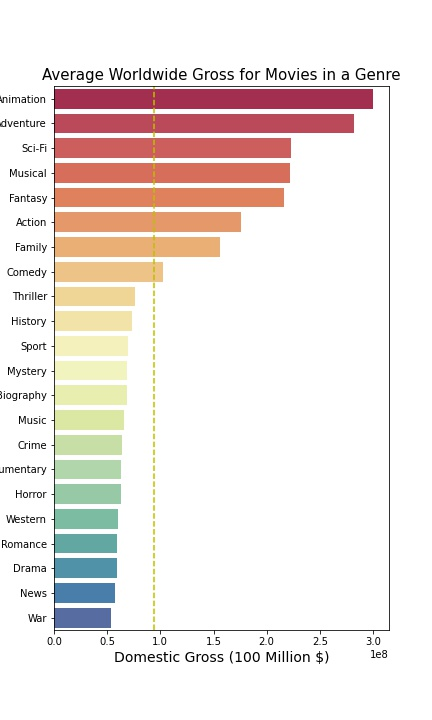
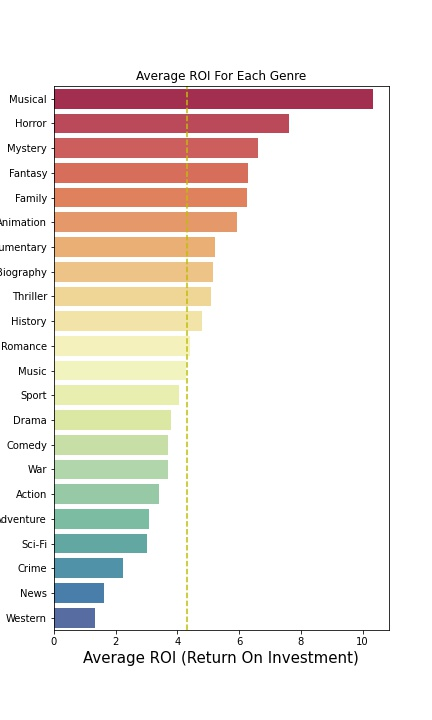
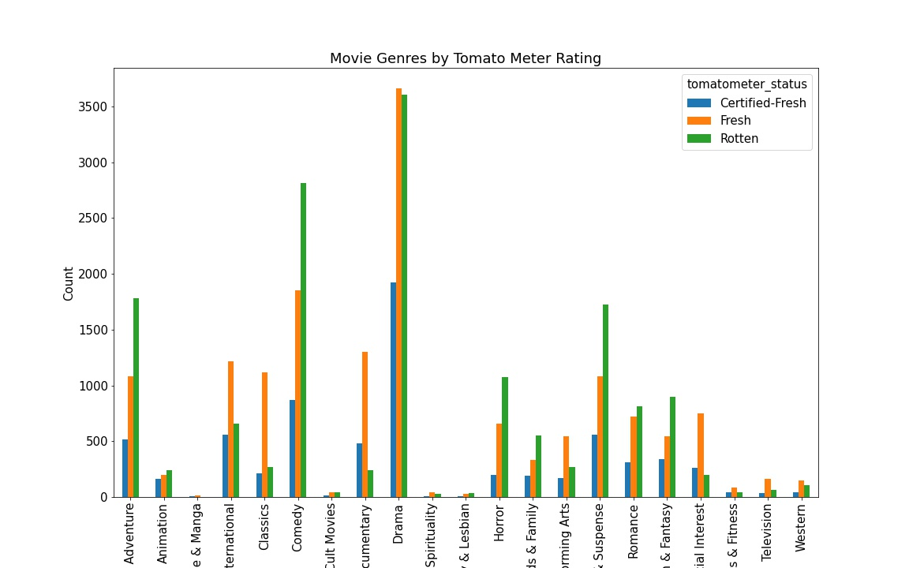
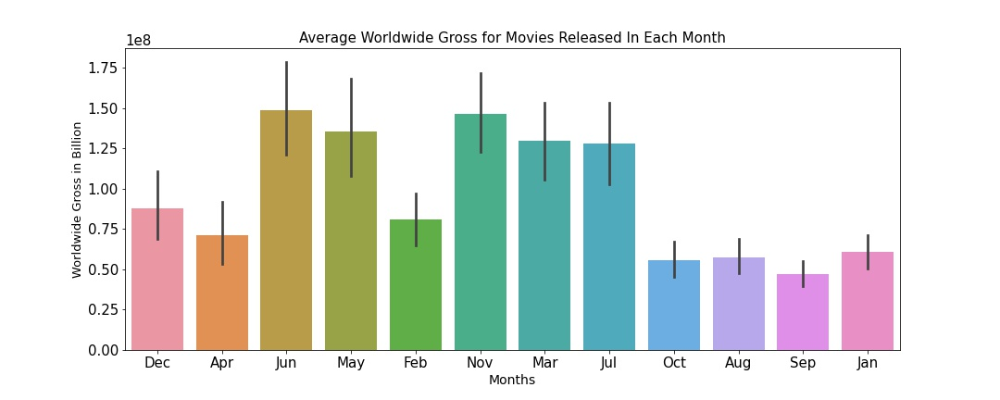
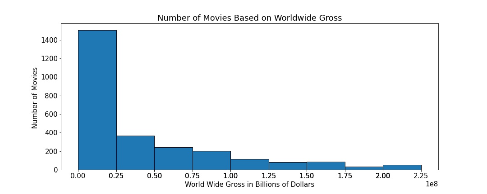
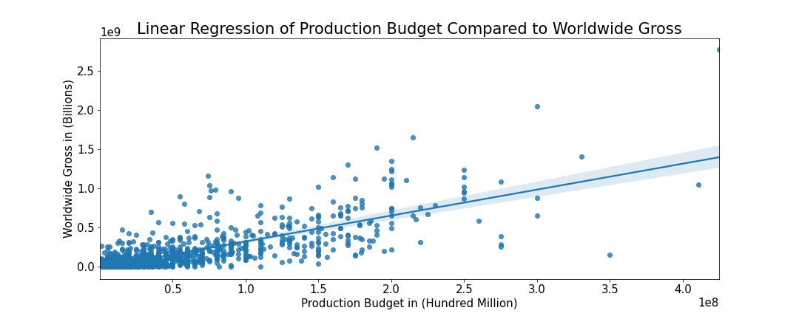
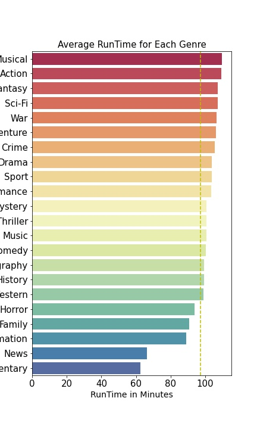
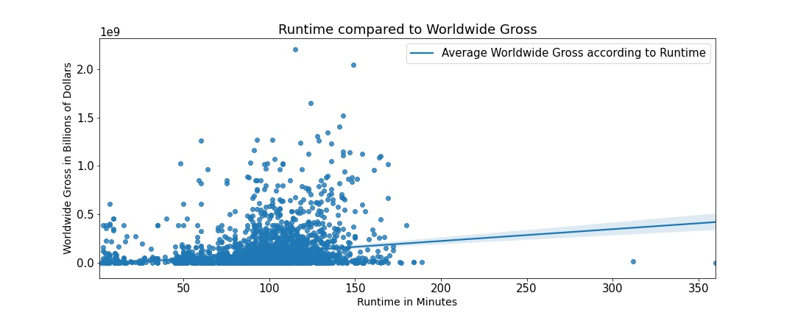

## Project 1 - Microsoft Movie Analysis

**Authors**: Kyle Vosen, Charlie Fountain, Griffin Riner

## Overview

This project analyzes movie data that helped us come to 3 informed decisions to help Microsoft with its journey to creating a new movie studio. The analysis of the movie industry allowed us to make an informed decision about what genre of movie Microsoft should produce and when to release it. What Microsoft should aim their worldwide gross to be when compared to their budget. Lastly, what the runtime should be for each of Microsofts movies. Microsoft can use our informed decisions to create the best chance of making a succesful movie.  

## Business Problem

Microsoft has decided to enter the movie production industry and create a new movie studio, but they want some advice. This project asks and analyzes which genre of films are doing best at the box office, what the average runtime is, and how much money Microsoft should expect to make compared to their production budget. The results will inform decisions and actions Microsoft's studio can take to create a successful production company.

## Data

The data being used for this project comes from the imdb_title_basics, tn_movie_budget, tmdb_movies, and rotten_tomatoes_movies. This data was provided to us through the movies data base seen below. We used this data to create unique effective visualizations that will help us explain the path that we believe Microsoft should follow in order to have the best chance of success in their new fight between giants like Disney and Netflix.  


## Methods

To gather the data relevent to our proposal we used the movie data provided to us and used a number of SQL queries to search though the data. We then cleaned up that data and used seaborn as well as matplotlib to create visualizations that are key to explaining the path we think Microsoft should follow as well as being visually appealing and easy to read.  

## Results

The genres of Animation, Adventure, Sci-Fi, Musical, Fantasy, Action, Family, and Comedy are all above the average line for the average worldwide gross earned by each genre.



The graph belows shows how the genres for Musical, Horror, Mystery, Fantasy, Family, Animation, Documentary, Biography, Thriller, History, and Romance are all above the average line for Return on investment for each genre. 



From the graph below we can see the popularity rating for each genre based on rottentomatoes metrics 



Lastly we can see from the graph what the average worldwide gross is for movies released in each month. 



Most movies make anywhere for 0 to 250,000,000 million dollars for their worldwide gross.



This graph is used to help Microsoft set a goal for their worldwide gross when they are deciding to make a production budget. For instance if Microsoft decides they want to spend $150,000,000 on their production budget they want to aim for making around $450,000,000. 



The average runtime for all movies produced in our data set is 97 minutes with most of the movies having a run time of anywhere between 75 and 125 minutes.

This clarifies the graph above and goes into more detail and shows just how many genres have an average runtime above 97 minutes.



As it can be seen there is a large clump of data point inbetween the runtime of 75 to 150. Although a large quantity of data points are below the regression line we also see that there is a large amount of data points above the regression line meaning that having a runtime of between 100 and 150 minutes there is a greater chance of having a higher grossing movie. 



## Conclusion

This analysis leads to 3 recommendations

1. Microsoft should produce either a Musical, Animation, Fantasy, or Family movie and release it in either June or November. 

2. Based on Microsofts production budget they should use the regression plot to aim for a worldwide gross goal that is correlated to its production budget

3. Microsoft should aim to make their movies anywhere between 90 and 125 minutes 

## For More Information

Please review our full analysis in [our Jupyter Notebook](./dsc-phase1-project.ipynb) or our [presentation](./DS_Project_Presentation.pdf) 

For any additional questions, please contact **Kyle Vosen: kylevosen1999@gmail.com, Charlie Fountain: charliefountain122@gmail.com, Griffin Riner: gnr400800@gmail.com**

## Repository Structure

Describe the structure of your repository and its contents, for example:
```
├── Extra                               <- Generated from code
├── data                                <- Both sourced externally and generated from code
├── images                              <- Both sourced externally and generated from code
├── src                                 <- Both sourced externally and generated from code
├── .gitignore                          <- Large Files, Came with Dataset 
├── DS_Project_Presentation.pdf         <- PDF version of project presentation
├── README.md                           <- The top-level README for reviewers of this project
├── dsc-phase1-project-template.ipynb   <- Narrative documentation of analysis in Jupyter notebook
```
